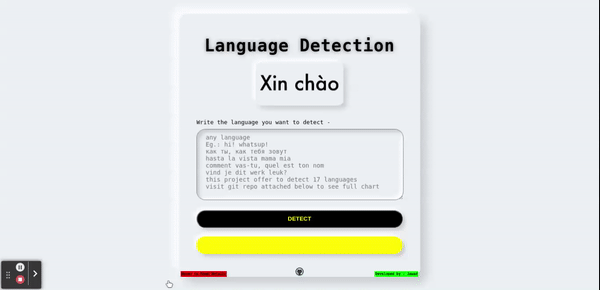

# Language-Detection using ML
This is a project that detect language using machine learning. Currently it is offering 17 languages.  

<!-- PROJECT LOGO -->
 

  

<a href="abidjawad.pythonanywhere.com">Here's the link of the site, take a view.<a>
  Or access directly - abidjawad.pythonanywhere.com

 #

<!-- TABLE OF CONTENTS -->

  
<bold>Table of Contents</bold>

  <ol>
    <li>
      <a href="#about2">About The Project</a>
      <ul>
        <li><a href="#build3">Features</a></li>
        <li><a href="#build2">Built With</a></li>
      </ul>
    </li>
    <li><a href="#usage2">Usage</a></li>
    <li><a href="#contact2">Contact</a></li>
  </ol>

<!-- ABOUT THE PROJECT -->
## About The Project
  
This is a project is done by using machine learning algorithm.
  
  

(<a href="#top">back to top</a>)

## Features
  
Here's the list of all supported languages, this tool can detect the language if you try any sentence or word from these languages.

 English  
 German  
 Sweedish  
 Arabic  
 Turkish 
 Kannada  
 Malayalam  
 Hindi  
 Tamil  
 Portugeese  
 French  
 Dutch  
 Spanish  
 Greek  
 Russian  
 Danish  
 Italian

(<a href="#top">back to top</a>)
    

  
## Built With

* [Python](https://nextjs.org/)
* [Django](https://reactjs.org/)
* [scikit-learn](https://reactjs.org/)
* [html](https://vuejs.org/)
* [CSS](https://angular.io/)
* [venv](https://getbootstrap.com)
* [Pickle](https://jquery.com)

(<a href="#top">back to top</a>)

<!-- USAGE EXAMPLES -->
## Usage

I've attached here some preview of this project. Although i'll strongly recommend to visit the site to have a better overview. 
   

     
  

(<a href="#top">back to top</a>)

<!-- CONTACT -->
## Contact

You may contact with me via gmail or any other way. All necessary contact info you will find at - 
<a href="https://hurutta.github.io"> my website. <a>

(<a href="#top">back to top</a>)

